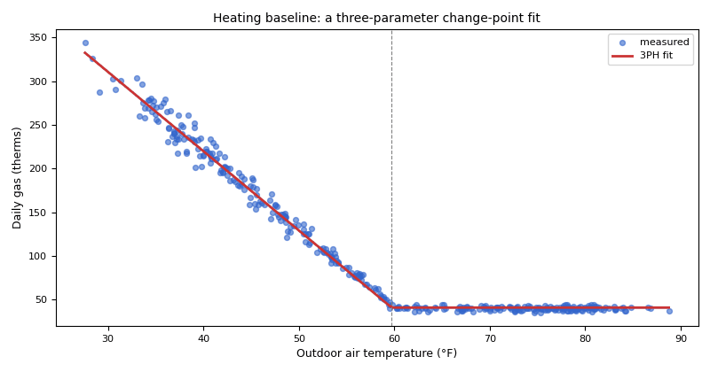

# Change-point baselines and M&V: forecast, backcast, chaining and bills

*Workbook exercise `mv-baselines` · PNNL re-tuning chapters 4 and 10 · about 90 minutes*

## Goal

Re-tuning is only finished when its savings are measured. Build weather-normalized change-point
baselines, judge them against the G14 acceptance tiers and SEP's model-validity tests, and
measure a saving four ways: a forecast, a backcast, a three-year chain, and a chain across a
closure that has to be handled as a non-routine event. Then do it again with nothing but
monthly bills, and see what bills can and cannot tell you.

## Learn more

Read these first (PNNL, free):

- [Chapter 4: Trend Data Collection and Analysis][pnnl-retuning-ch4] of the re-tuning training,
  for the whole-building baseline you are about to fit.
- [Chapter 10: Re-Tuning Building Controls and Systems][pnnl-retuning-ch10], for where
  measuring the result fits in the re-tuning process.

[pnnl-retuning-ch4]: https://www.pnnl.gov/sites/default/files/media/file/ch4_pre-re-tuning.pdf "Large Commercial Buildings: Re-tuning for Efficiency, chapter 4: Pre-Re-Tuning Phase: Trend Data Collection and Analysis (PNNL-SA-85063)"
[pnnl-retuning-ch10]: https://www.pnnl.gov/sites/default/files/media/file/ch10_retuning_building.pdf "Large Commercial Buildings: Re-tuning for Efficiency, chapter 10: Re-Tuning Building Controls and Systems (PNNL-SA-85063)"

The M&V standards are cited by section only; CAMBER's [M&V page](../MANDV.md) says how each is
applied:

- **IPMVP** (EVO, 2012, Vol. I): Option C (whole facility), and §4.5.3 for the
  routine and non-routine adjustment terms.
- **ASHRAE Guideline 14-2014**: its whole-building acceptance criteria and the Annex B savings
  uncertainty. CAMBER's G14 gate is CV(RMSE) (30 % daily, 15 % monthly), |NMBE| at most 0.5 %
  and R² at least 0.75.
- **DOE SEP 50001 M&V Protocol** (2019 Edition 2): §6.2 (forecast, backcast, chaining),
  §6.4.1 (model validity: the overall F-test, the variables' p-values and an R² of 0.50 or more),
  §5.3.2 (evidence and approval for an adjustment).

## Datasets and licence

- **`cofactor-drammen`**: hourly energy of 45 public buildings in Drammen, Norway, 2018-2021, each
  with its own outdoor temperature. Licence **CC-BY-4.0** (open; cite it). About 22 MB. See
  [its data issues](../DATASETS.md#cofactor-drammen-cofactor-drammen-45-norwegian-public-buildings-hourly-energy).
- **`valladolid-uva`**: two university buildings in Valladolid, Spain, hourly electricity
  2016-2020. Licence **CC-BY-4.0** (open; cite it). About 6 MB. See
  [its data issues](../DATASETS.md#valladolid-uva-valladolid-university-buildings-hourly-whole-building-electricity-2016-2020).
- **`bdg2`**: the Building Data Genome 2 meters; one Fox lodging building's meters become
  **synthetic bills** (below). Licence **CC-BY-SA-4.0** (open; cite it). About 270 MB. See
  [its data issues](../DATASETS.md#bdg2-building-data-genome-2-whole-building-meters).

The meters used: the COFACTOR main meters `b6400_ElImp` and `b6404_ElImp` (two schools) and
`b6410_ElImp` (a nursing home); `UVA_A` (Faculty of Science) and `UVA_B` (Faculty of Economics,
where the publisher describes an equipment replacement); `Fox_lodging_Stephen__chilledwater` and
`Fox_lodging_Stephen__electricity`.

**The bills are synthetic.** No utility issued them: `make_bills.py` below cuts a real hourly
meter into read-to-read periods of 28 to 35 days, so the bill-only method can be tried on data
anyone can check. Label them synthetic wherever you show them.

## Setup

### In the lab

1. Run `camber lab` and open `http://127.0.0.1:8765/lab`.
2. Tick `cofactor-drammen`, `valladolid-uva` and `bdg2` and press **Fetch & ingest**.
3. Use **trends** to look at the meters; the M&V runs below use the command line.

### On the command line

```
camber datasets fetch cofactor-drammen
camber datasets fetch valladolid-uva
camber datasets fetch bdg2
camber datasets ingest cofactor-drammen valladolid-uva bdg2 --store lab_store
```

**Part 1, forecast and backcast.** The same three COFACTOR meters, 2018 against 2019, once each
way. Both configs model each day's energy on its mean outdoor temperature plus an occupied-day
driver (weekdays that are not Norwegian public holidays):

```
camber datasets config cofactor-drammen --exercise mv-baselines--forecast --store lab_store --out fc.json
camber run fc.json --out fc_out
camber datasets config cofactor-drammen --exercise mv-baselines--backcast --store lab_store --out bc.json
camber run bc.json --out bc_out
```

**Part 2, chaining.** The two Valladolid buildings: 2016 baseline, 2017 intermediate, 2018
reporting, with an occupied-day driver on Castilla y León's public holidays:

```
camber datasets config valladolid-uva --exercise mv-baselines --store lab_store --out chain.json
camber run chain.json --out chain_out
```

**Part 3, a chain across a closure.** The COFACTOR meters chained 2018, 2019, 2020, with the
spring 2020 school closure entered as a non-routine adjustment (read its ledger entry in
`covid.json`):

```
camber datasets config cofactor-drammen --exercise mv-baselines--covid --store lab_store --out covid.json
camber run covid.json --out covid_out
```

**Part 4, bills only.** Save this as `make_bills.py` next to `lab_store`:

```python
import sys

import pandas as pd
from camber.store import ParquetStore

store, equip, out = sys.argv[1], sys.argv[2], sys.argv[3]
frame = ParquetStore(store).read_role_frame(facility_id="ds-bdg2-fox", equip=equip)
daily = frame.iloc[:, 0].resample("1D").sum(min_count=24)  # NaN unless all 24 hours
lengths = [30, 33, 28, 31, 35, 29, 32]  # read-to-read days, repeating
rows, start, k = [], daily.index[0], 0
while start <= daily.index[-1]:
    end = start + pd.Timedelta(days=lengths[k % len(lengths)] - 1)
    days = daily[start:end]
    if len(days) == (end - start).days + 1 and days.notna().all():  # no missing day
        rows.append({"start": start.date(), "end": end.date(), "energy": round(days.sum(), 1)})
    start, k = end + pd.Timedelta(days=1), k + 1
pd.DataFrame(rows).to_csv(out, index=False)
print(len(rows), "synthetic bills written to", out)
```

and this as `bills.json`: the 2016 bills are the baseline, the 2017 bills the reporting period,
and the degree-day bases are chosen from the bills (`"base_f": "auto"`):

```json
{
  "source": {"kind": "store", "store": "lab_store", "facility_id": "ds-bdg2-fox"},
  "shared_oat": {"equip": "weather", "role": "oat"},
  "rules": [],
  "mv": [{"bills": {"file": "bills.csv", "energy": "energy"}, "name": "synthetic bills",
          "period": ["2016-01-01", "2016-12-31"],
          "reporting_period": ["2017-01-01", "2017-12-31"],
          "method": "forecast", "base_f": "auto", "calendarize": true, "validity": "both"}]
}
```

Then:

```
python make_bills.py lab_store Fox_lodging_Stephen__chilledwater bills.csv
camber run bills.json --out bills_out
```

Repeat the two commands with `Fox_lodging_Stephen__electricity` for the second meter.

## Steps

1. **Judge the baselines.** In `fc_out/findings.json`, read each meter's `mv_baseline`: model
   form, R², CV(RMSE), NMBE and `accept` (the G14 gate).
2. **Forecast.** Read each `mv_savings`: the avoided energy, its 90 % band (`abs_uncertainty`),
   `sep_valid` and the caveats. No energy measure is documented at these buildings in 2019.
3. **Backcast.** Compare `bc_out` with `fc_out`, meter by meter.
4. **Chain.** In `chain_out`, read both buildings' baselines and their chained savings, SEnPI
   and caveats.
5. **Across the closure.** In `covid_out`, compare `savings` with `adjusted_savings` and read the
   `adjustments` entry (its `rate`, `resolved_amount` and `material`).
6. **Bills.** Build both bill files and read `bills_out`: `n_bills`, the chosen bases, R²,
   CV(RMSE) against the monthly tier, the `model_comparison` table and the caveats.

## Questions

1. Which 2018 COFACTOR baselines meet the G14 gate, and why does `b6404_ElImp`'s not, although
   its CV(RMSE) is within the daily tier? What does SEP §6.4.1 say about the same model?
2. The forecast puts one school's 2019 saving outside its uncertainty band. Which school, how
   large a saving, and does the backcast agree? What would you do before reporting it?
3. Is the nursing home's forecast saving distinguishable from zero?
4. In the Valladolid chain, what saving does each building show, and is either baseline
   acceptable under G14? Under SEP's R² test? What does the chain leave unmodelled?
5. What does the closure adjustment do to `b6400_ElImp`'s chained saving, and why does the
   unadjusted figure mislead?
6. For the synthetic chilled-water bills: how many bills make the baseline, which cooling base
   do the bills choose, and why does a fit with a high R² still fail the monthly G14 tier?
7. For the synthetic electricity bills: what does R² say, and why is the model not SEP-valid?
   Is the forecast saving meaningful?

## What CAMBER shows

- **`mv_baseline`**: `model` and `model_form`, `r2`, `cv_rmse`, `nmbe`, `accept`, `rho`; for
  bills also `n_bills`, `n_days`, `heating_base_f` / `cooling_base_f`, `base_selection`,
  `model_comparison` and `calendarized`.
- **`mv_savings`**: `method`, `basis`, `kernel`, the saving and `savings_pct`,
  `abs_uncertainty` at 90 %, `coverage_tier`, `enpi` (the SEnPI), `sep_valid` with
  `sep_validity`; for a chain the intermediate model; with a ledger `adjusted_*`,
  `adjustments` and the `waterfall`.
- **Caveats** on every finding: they say when a saving is "for information only", when a model
  is not SEP-valid and why, and when the band is optimistic.
- `camber mv report` draws the same results as an HTML page (see [M&V](../MANDV.md)).



*Synthetic illustration, not this exercise's dataset: a daily heating baseline fitted with `best_model`. Gas use falls with outdoor temperature down to a base load above the change point near 60 °F.*

## Caveats

- A saving with no documented measure behind it is a change to explain, not a saving to claim.
- CAMBER's G14 gate (above) is CAMBER's reading of the guideline; CalTRACK is stricter in other
  ways (see [M&V](../MANDV.md)).
- The occupied-day driver knows public holidays, not school breaks or academic calendars. Both
  datasets have breaks the driver cannot see.
- A meter-derived non-routine adjustment carries IPMVP's caution about using the same meter for
  the event and the saving; CAMBER prints it as a caveat.
- The bills are synthetic and whole-day exact: real bills carry estimated reads, meter-read
  timing and rounding.
- The default kernel is G14's; its caveat says the exact kernel covers better. Try
  `"kernel": "exact"` in the configs.

## Going further

- Add `"kernel": "exact"` to `fc.json` and compare the bands.
- Replace the chain's occupied-day driver with an explicit academic calendar
  (`break_calendar`, see [M&V](../MANDV.md)) and re-run part 2.
- Version the forecast baseline: add `"mv_store": "mv_baselines.json"` to `fc.json`, run
  `camber mv freeze fc.json --reason "2018 baseline"` (a dry run; add `--apply` to write), then
  `camber mv run fc.json` and `camber mv report fc.json --out mv.html`.
