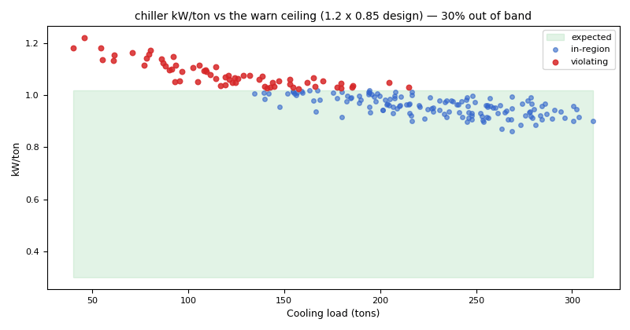

# Chiller efficiency: calibrating a design ceiling, and chiller fouling

*Workbook exercise `plant-chiller-efficiency` · PNNL re-tuning chapter 8 · about 45 minutes*

## Goal

Judge a chiller's kW/ton against a ceiling that fits *this* chiller. First see what a generic
ceiling does to a healthy plant. Then calibrate the ceiling from the plant's own fault-free run and
find the runs that really cost energy: a fouled chiller and a leaking tower bypass. Finally, score
the rule against the dataset's published labels.

## Learn more

Read these first (PNNL, free):

- [Central Utility Plant Cooling Control][pnnl-guide-plant-cooling], the re-tuning guide, for
  how a water-cooled plant is controlled and which points to trend. It judges the plant by its
  controls (reset, delta-T, pumping; see [the reset and pumping exercise](plant-chw-reset-pumping.md))
  rather than by kW/ton, which is what this exercise adds.
- [Chapter 8: Central Utility Plant][pnnl-retuning-ch8] of the re-tuning training, for the
  central plant as a whole.

[pnnl-guide-plant-cooling]: https://www.pnnl.gov/sites/default/files/media/file/pnnl_sa_89198.pdf "Building Re-Tuning Training Guide: Central Utility Plant Cooling Control (PNNL-SA-89198)"
[pnnl-retuning-ch8]: https://www.pnnl.gov/sites/default/files/media/file/ch8_central_plant.pdf "Large Commercial Buildings: Re-tuning for Efficiency, chapter 8: Central Utility Plant: Pre-Re-Tuning and Re-Tuning (PNNL-SA-85063)"

## Datasets and licence

- **`lbnl-chiller`**: LBNL's simulated water-side chiller plant (three chillers, three cooling
  towers, primary and secondary chilled-water loops), a year at one-minute resolution, as a
  fault-free run plus labelled faulted runs. Licence **CC-BY-4.0** (open; cite it). The download
  is about 1.6 GB; this exercise ingests the `full` subset (all 24 runs). The catalog lists the
  problems found in the published data and how CAMBER handles each: see
  [its data issues](../DATASETS.md#lbnl-chiller-lbnl-simulated-chiller-plant-labelled-faults).

Each run becomes one piece of equipment, `PLANT__<run>`, in the facility `ds-lbnl-chiller`
(chiller 1 and tower 1 are the mapped units). This exercise reads `PLANT__fault_free`, the two
chiller-fouling runs (`PLANT__chiller_fouling_065`, the severe one, and
`PLANT__chiller_fouling_095`), the tower-fouling runs (`PLANT__coolingtower_fouling_065` ...),
the tower-bypass runs (`PLANT__bypass_leakage_025` ... `PLANT__bypass_stuck_075`) and, for the
score, every other run.

## Setup

### In the lab

1. Run `camber lab` and open the URL it prints (`http://127.0.0.1:8765/lab?token=...`).
2. Choose the **full** subset, tick `lbnl-chiller` and press **Fetch & ingest**.
3. When the job is done, the row links to **trends** (the trend viewer) and **report** (the
   dataset's default config, which is this exercise's second run). The first run uses its own
   config: use the command line for it.

### On the command line

```
camber datasets fetch lbnl-chiller
camber datasets ingest lbnl-chiller --subset full --store lab_store
camber datasets config lbnl-chiller --exercise plant-chiller-efficiency--generic --store lab_store --out generic.json
camber run generic.json --out generic_out
camber datasets score lbnl-chiller --store lab_store --findings generic_out/findings.json
camber datasets config lbnl-chiller --store lab_store --out chiller.json
camber run chiller.json --out chiller_out
camber datasets score lbnl-chiller --store lab_store --findings chiller_out/findings.json
```

The first config (`--exercise plant-chiller-efficiency--generic`) runs `chiller_efficiency` with
the rule's own generic ceiling of 0.85 kW/ton. The second is the dataset's default config: the
same rule with a ceiling calibrated from the fault-free run (its value is in the config),
because the simulated chiller's design curve is not published, plus `cooling_tower_approach` (the subject of
[the cooling-tower exercise](plant-cooling-tower.md)). Read the `_comment` in each config file.

## Steps

1. **Look before you judge.** In the trend viewer, open `PLANT__fault_free` and plot the chiller
   power with the chilled-water supply and return temperatures over a summer week. When is the
   chiller loaded, and when does it idle?
2. **Run the generic config** and read what `camber run` prints for `PLANT__fault_free`. Score it
   with `camber datasets score`.
3. **Run the calibrated config** and read `chiller_efficiency` for the fault-free run again.
4. **Chiller fouling.** Compare `kw_per_ton_median` and `pct_hours_inefficient` in
   `chiller_out/findings.json` for `PLANT__chiller_fouling_065`, `PLANT__chiller_fouling_095` and
   `PLANT__fault_free`.
5. **Other faults.** Find the other runs `chiller_efficiency` flags, and look at the worst tower
   fouling, `PLANT__coolingtower_fouling_065`.
6. **Score.** Run `camber datasets score` on the calibrated findings and read the per-detector
   rates and the list of which rule fired on which run.

## Questions

1. With the generic ceiling, what does CAMBER say about the fault-free plant? What true- and
   false-positive rates does the score give `chiller_efficiency`, and why is a detector that
   catches every fault still useless here?
2. With the calibrated ceiling, what does the fault-free chiller read, and why is that the right
   reference for this plant?
3. How far do the two chiller-fouling runs move the kW/ton? Why does CAMBER flag one and not the
   other, and what in the finding still shows the milder one?
4. Which other runs does the rule flag, and which fault barely moves the chiller's kW/ton at
   all? Where would you look for that one instead?
5. What does the label score give `chiller_efficiency` with the calibrated ceiling, and which runs
   count as its false alarms?

## What CAMBER shows

- **Findings.** `camber run` prints one line per finding with its severity (`fault`, `warn`, `ok`)
  and the median kW/ton against the ceiling. `findings.json` holds the metrics: `kw_per_ton_median`,
  `design_kw_per_ton`, `tons_median`, `load_factor_median_pct` and `pct_hours_inefficient` (the
  share of loaded hours more than 15 % above the ceiling).
- **Severity bands.** `warn` from 1.2 times the ceiling, `fault` from 1.5 times, judged only on
  hours when the chiller draws power and makes at least 5 tons of cooling.
- **Score.** `camber datasets score` prints the true- and false-positive rates, with 95 %
  intervals, for the dataset's declared detectors, and which rules fired on each labelled run.



*Synthetic illustration, not this exercise's dataset: kW/ton against load, drawn with CAMBER's diagnostic scatter and a band up to the rule's warn ceiling (1.2 times the 0.85 kW/ton design). The degraded chiller crosses it at part load.*

## Caveats

- The data are simulated. A real chiller's ceiling comes from its schedule (kW/ton at design and
  part load), or from its own commissioned, healthy operation, never from a generic number.
- Calibrating on the fault-free run assumes that run is healthy. On a real plant that is the
  claim to check first.
- The kW/ton is computed from the chilled-water flow and temperatures. A biased temperature sensor
  changes the computed tons, not only the power; see
  [the sensor exercise](plant-sensor-vs-equipment.md).
- The chiller-fouling runs are in the archive but not in the dataset's inventory; their severity
  is read from the file names (see the data issues).
- One median over a year hides when the fouling started. A drift comparison against a baseline
  period is the tool for that (`camber drift`).

## Going further

- Edit `chiller.json` and try ceilings between the two: at what ceiling does the milder chiller
  fouling appear, and what else appears with it?
- Open the report (`camber report chiller.json --out chiller.html`) and compare the evidence for
  the two chiller-fouling runs.
- Read the [cooling-tower exercise](plant-cooling-tower.md) for the fault this rule misses.
