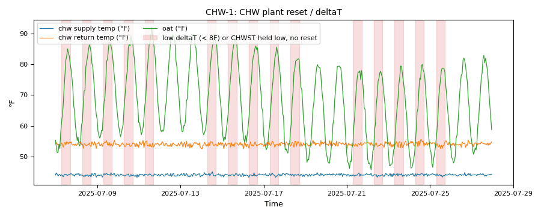

# Chilled-water reset and pumping: low delta-T, riding the curve and the VFD minimum

*Workbook exercise `plant-chw-reset-pumping` · PNNL re-tuning chapter 8 · about 40 minutes*

## Goal

Answer the chilled-water side's three re-tuning questions on a simulated plant: is the supply
temperature reset, is the loop delta-T low, and is the loop differential-pressure (DP) setpoint
reset or held constant? Then see what a stuck tower bypass does to the chilled water and to the
pumps, and how the rules read a constant-flow plant and a pump's own VFD floor.

## Learn more

Read these first (PNNL, free):

- [Central Utility Plant Cooling Control][pnnl-guide-plant-cooling], the re-tuning guide: its
  three questions (a reset on the chilled-water supply temperature, a low loop delta-T, and a
  constant loop DP setpoint that could be reset at part load) are the three halves of this
  exercise, plus the pump that serves them.
- [Chapter 8: Central Utility Plant][pnnl-retuning-ch8] of the re-tuning training.

[pnnl-guide-plant-cooling]: https://www.pnnl.gov/sites/default/files/media/file/pnnl_sa_89198.pdf "Building Re-Tuning Training Guide: Central Utility Plant Cooling Control (PNNL-SA-89198)"
[pnnl-retuning-ch8]: https://www.pnnl.gov/sites/default/files/media/file/ch8_central_plant.pdf "Large Commercial Buildings: Re-tuning for Efficiency, chapter 8: Central Utility Plant: Pre-Re-Tuning and Re-Tuning (PNNL-SA-85063)"

## Datasets and licence

- **`lbnl-chiller`**: LBNL's simulated water-side chiller plant (three chillers, three cooling
  towers, primary and secondary chilled-water loops), a year at one-minute resolution, as a
  fault-free run plus labelled faulted runs. Licence **CC-BY-4.0** (open; cite it). The download
  is about 1.6 GB; this exercise needs only the default subset (four runs). The catalog lists the
  problems found in the published data and how CAMBER handles each, among them a chilled-water
  reset that spans a different range from the one documented: see
  [its data issues](../DATASETS.md#lbnl-chiller-lbnl-simulated-chiller-plant-labelled-faults).

Each run becomes `PLANT__<run>` in the facility `ds-lbnl-chiller`. The default subset holds
`PLANT__fault_free`, `PLANT__coolingtower_fouling_065`, `PLANT__bypass_stuck_075` and
`PLANT__chiller_bias_2`. The chilled-water temperatures are chiller 1's; the pump is the
secondary loop's lead pump.

## Setup

### In the lab

1. Run `camber lab` and open `http://127.0.0.1:8765/lab`.
2. Tick `lbnl-chiller` and press **Fetch & ingest** (the default subset is enough).
3. When the job is done, the row links to **trends** (the trend viewer). This exercise uses its
   own config: use the command line for step 2 of the steps below.

### On the command line

```
camber datasets fetch lbnl-chiller
camber datasets ingest lbnl-chiller --store lab_store
camber datasets config lbnl-chiller --exercise plant-chw-reset-pumping --store lab_store --out chw.json
camber run chw.json --out chw_out
```

The exercise's config (`--exercise plant-chw-reset-pumping`) runs two rules. `chw_plant_reset`
fits chiller 1's leaving-water temperature against the outdoor dry-bulb over the chiller's
running, occupied hours, checks that the slope goes the way a reset should, and reports the
loop delta-T against an 8 °F design minimum (`design_deltaT_min_f`). It also reads chiller 1's
flow: on a constant-flow plant the delta-T is reported but not judged. `chw_pump_dp_reset` reads
the secondary pump's speed and the loop's DP setpoint, and learns the pump's VFD floor from its
speeds. The exercise keeps every parameter at its default. The plant's chiller status point is
an enable, not a run status, so CAMBER decides when the chiller runs from its power.

## Steps

1. **Look before you judge.** In the trend viewer, open `PLANT__fault_free` and plot chiller 1's
   leaving and return water with the outdoor temperature over a spring month. Then plot the
   secondary pump speed and the loop DP with its setpoint over the same month.
2. **Run the exercise's config** (the commands above) and read the findings.
3. **Reset.** In `chw_out/findings.json`, read `chw_plant_reset` for the fault-free run:
   `chwst_reset_present`, `chwst_reset_direction`, `chwst_slope_per_F` and `chwst_median_f`.
4. **Delta-T.** In the same finding, read `deltaT_median_f`, `low_deltaT_pct`, `flow_mode`,
   `flow_cv` and the caveats.
5. **Pumping.** Read `chw_pump_dp_reset` for the fault-free run: `median_speed_pct`,
   `pct_running_near_full`, `pct_running_near_min`, `vfd_floor_pct`, `near_min_band_pct` and
   `dp_sp_reset_present`. Then find the run where the pump's median speed is lowest.
6. **The stuck bypass.** Compare both findings for `PLANT__bypass_stuck_075` with the fault-free
   run's.

## Questions

1. Is the chilled-water supply temperature reset? Which way does it move as the weather warms,
   and is that the right way?
2. What delta-T does `chw_plant_reset` find on the healthy plant, and why is the finding `ok`
   anyway? Is a low delta-T here a fault to fix or a property of the plant?
3. Is the DP setpoint reset? How hard does the secondary pump work, and what does the rule call
   it?
4. Where is the pump's VFD minimum, how does the rule find it, and what share of hours does it
   count near the minimum? On which run does the pump sit at its floor most?
5. What does the stuck tower bypass do to the chilled water and its delta-T, and to the pump?
   Which finding points at the cause, and which only at a symptom?

## What CAMBER shows

- **Findings.** `camber run` prints one line per finding with its severity and a summary.
  `findings.json` holds the metrics: for `chw_plant_reset` the supply median, its slope on the
  dry-bulb, whether a reset was found and which way it goes (`chwst_reset_direction`:
  `expected`, `reverse` or `flat`), the delta-T median and the share of running hours below
  8 °F, the flow mode and the flow's coefficient of variation, and `run_source` (what decided
  the chiller was running); for `chw_pump_dp_reset` the median speed, the shares near full (90 %
  or more) and near minimum, the learned VFD floor and the near-minimum band it used
  (`near_min_source`: `learned`, or `default` for 25 % when no floor is found), and whether the
  DP setpoint is reset.
- **Severity.** `chw_plant_reset` is a `fault` when half or more of the running hours are below
  the delta-T minimum, a `warn` from a fifth, or on a flat or reversed supply temperature; on a
  constant-flow plant the delta-T does not count. `chw_pump_dp_reset` is a `fault` at 60 % or
  more of the hours near full speed, a `warn` from 30 %, or at half the hours or more near the
  minimum.



*Synthetic illustration, not this exercise's dataset: the `chw_plant_reset` evidence trend. The supply is held at 44 °F whatever the outdoor temperature, a reset that never happens. The shaded hours are the occupied running hours the rule judged with the supply at or below 46 °F.*

## Caveats

- The delta-T is chiller 1's own, on a primary loop whose flow does not follow the load, so it
  is low at part load by design. The rule recognises this from the flow point; without one it
  cannot, and judges the delta-T (declare `flow_mode` then). The 8 °F minimum is generic: set
  `design_deltaT_min_f` from the loop's design.
- The rule expects a reset to lower the supply in hot weather (`expected_reset_sign`); a plant
  whose sequence does the opposite on purpose needs that parameter changed.
- The chilled-water setpoint point is in the data but is not mapped (see the data issues), so
  CAMBER judges the reset from the supply temperature itself.
- The learned floor is a plateau in the speeds, not the drive's setting: a pump that rarely
  reaches its floor falls back to the 25 % band. Set `near_min_pct` from the VFD parameters when
  you know them.
- The data are simulated: one plant, one climate, one control sequence.

## Going further

- In the trend viewer, find the winter months: what does the pump do when there is no cooling
  load at all? Is that a scheduling opportunity?
- Run the same config on the `full` subset and compare the chiller- and pressure-sensor-bias
  runs with the fault-free one: see [the sensor exercise](plant-sensor-vs-equipment.md).
- Compare with the air side's supply-air temperature reset: a warmer chilled-water supply in
  mild weather only works while the air handlers still reach their discharge temperature.
