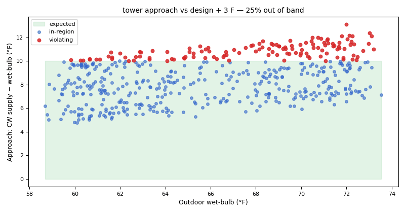

# Cooling tower: approach, fan effort and a leaking tower bypass

*Workbook exercise `plant-cooling-tower` · PNNL re-tuning chapter 8 · about 40 minutes*

## Goal

Judge a cooling tower the way its controller sees it. A tower that holds its leaving water at a
setpoint hides fouling in its fan: the approach barely moves while the fan works harder. Find that
effort in CAMBER's findings, check the condenser-water reset, and find a tower bypass valve that
lets water skip the tower while it is commanded shut.

## Learn more

Read these first (PNNL, free):

- [Central Utility Plant Cooling Control][pnnl-guide-plant-cooling], the re-tuning guide, for the
  water-cooled plant this tower serves and the points worth trending.
- [Chapter 8: Central Utility Plant][pnnl-retuning-ch8] of the re-tuning training, for the
  central plant as a whole, towers included.

[pnnl-guide-plant-cooling]: https://www.pnnl.gov/sites/default/files/media/file/pnnl_sa_89198.pdf "Building Re-Tuning Training Guide: Central Utility Plant Cooling Control (PNNL-SA-89198)"
[pnnl-retuning-ch8]: https://www.pnnl.gov/sites/default/files/media/file/ch8_central_plant.pdf "Large Commercial Buildings: Re-tuning for Efficiency, chapter 8: Central Utility Plant: Pre-Re-Tuning and Re-Tuning (PNNL-SA-85063)"

## Datasets and licence

- **`lbnl-chiller`**: LBNL's simulated water-side chiller plant (three chillers, three cooling
  towers, primary and secondary chilled-water loops), a year at one-minute resolution, as a
  fault-free run plus labelled faulted runs. Licence **CC-BY-4.0** (open; cite it). The download
  is about 1.6 GB; this exercise ingests the `full` subset (all 24 runs). The catalog lists the
  problems found in the published data and how CAMBER handles each, among them the swapped
  outdoor dry-bulb and wet-bulb columns that CAMBER fixes at ingest: see
  [its data issues](../DATASETS.md#lbnl-chiller-lbnl-simulated-chiller-plant-labelled-faults).

Each run becomes `PLANT__<run>` in the facility `ds-lbnl-chiller`; tower 1 is the mapped tower.
This exercise reads `PLANT__fault_free`, the three tower-fouling runs
(`PLANT__coolingtower_fouling_065`, the most severe, `_080` and `_095`), the tower controller's
PI mistuning (`PLANT__coolingtower_PI`) and the five tower-bypass runs
(`PLANT__bypass_leakage_025` ... `PLANT__bypass_stuck_075`).

## Setup

### In the lab

1. Run `camber lab` and open the URL it prints (`http://127.0.0.1:8765/lab?token=...`).
2. Choose the **full** subset, tick `lbnl-chiller` and press **Fetch & ingest**.
3. When the job is done, the row links to **trends** (the trend viewer). This exercise uses its
   own config: use the command line for step 2 of the steps below.

### On the command line

```
camber datasets fetch lbnl-chiller
camber datasets ingest lbnl-chiller --subset full --store lab_store
camber datasets config lbnl-chiller --exercise plant-cooling-tower --store lab_store --out tower.json
camber run tower.json --out tower_out
camber datasets score lbnl-chiller --store lab_store --findings tower_out/findings.json
```

The exercise's config (`--exercise plant-cooling-tower`) runs three rules:
`cooling_tower_approach`, with the design approach the dataset template calibrates from the
fault-free run, judged only when the tower fan runs at 90 % or more; `condenser_water_reset`; and
`condenser_bypass_leak`, which compares the water entering the chillers with the water leaving
the tower while the bypass valve is commanded shut. Its `drift` section adds the tower drift
family with a **declared reference**: `cooling_tower_fan_effort_drift` scores every run's fan
effort against `PLANT__fault_free`, fitted in memory on each run and never stored.

## Steps

1. **Look before you judge.** In the trend viewer, open `PLANT__fault_free` and
   `PLANT__coolingtower_fouling_065`. Plot the tower's leaving water, the wet-bulb and the tower
   fan speed over a hot week. What does the controller hold constant, and what changes?
2. **Run the exercise's config** (the commands above) and read the findings `camber run` prints.
3. **Approach.** In `tower_out/findings.json`, compare `cooling_tower_approach` for the
   fault-free and the 65 % fouled tower: `approach_median_f`, `pct_hours_high_approach` and
   `n_operating` (the hours the rule judged: fan at 90 % or more).
4. **Reset.** Read `condenser_water_reset` for the fault-free run: `cws_slope_per_wetbulb`.
5. **Bypass.** Read `condenser_bypass_leak` for the bypass runs and for the fault-free run, and
   read what `cooling_tower_approach` says about the bypass runs.
6. **Fan effort against a reference.** Read `cooling_tower_fan_effort_drift` for the three
   tower-fouling runs, the fault-free run and the tower-sensor-bias runs
   (`PLANT__coolingtower_bias_1`, `_2`): `fan_effort_drift_pct`, `attribution` and the summary.
   Then run `camber datasets score` and read the rates for `cooling_tower_approach` and
   `cooling_tower_fan_effort_drift`.

## Questions

1. What approach does the healthy tower achieve at high fan, and what does CAMBER say about it?
2. Is the 65 % fouled tower flagged? How far does its approach move, and in how many more of its
   judged hours is the approach high?
3. Where does the fouling show instead? Compare how many hours each tower spends at high fan.
4. Does the condenser-water supply follow the wet-bulb? What slope does CAMBER find?
5. What does `condenser_bypass_leak` find on the stuck bypass, and why can the approach rule not
   judge the bypass runs at all?
6. What does the label score give `cooling_tower_approach`? What does
   `cooling_tower_fan_effort_drift` measure instead, which foulings does it catch against the
   reference, and what does it say about the fault-free run and the tower-sensor biases?

## What CAMBER shows

- **Findings.** `camber run` prints one line per finding with its severity. `findings.json` holds
  the metrics: `approach_median_f`, `pct_hours_high_approach` (hours more than 3 °F above the
  design approach), `n_operating` and `n_low_effort_excluded` for `cooling_tower_approach`;
  `cws_slope_per_wetbulb` and `reset_present` for `condenser_water_reset`; `median_diff_f`,
  `bypass_fraction_est` and `attribution` for `condenser_bypass_leak`;
  `fan_effort_drift_pct` (fan %-points at matched condenser range and wet-bulb),
  `sensor_offset_shift_f`, `attribution` and `baseline_source` for
  `cooling_tower_fan_effort_drift`.
- **Declines.** A rule that cannot judge says why in its summary (an `info` finding): for example
  a tower fan that never reached the effort gate. The declared reference itself declines as
  `is_reference`: it is the yardstick, not a result.
- **Score.** `camber datasets score` prints the true- and false-positive rates, with 95 %
  intervals, for the dataset's declared detectors.



*Synthetic illustration, not this exercise's dataset: the `cooling_tower_approach` evidence chart. Tower approach (condenser-water supply minus wet-bulb) against wet-bulb, over the samples the rule judged, with a band up to the design approach plus 3 °F. The red points are the samples `pct_hours_high_approach` counts. The approach grows week by week.*

## Caveats

- The data are simulated. The simulated tower's design approach is not published, so the config's
  ceiling is the fault-free run's own median at high fan: a calibration, not a design value.
- The tower holds its leaving water at the wet-bulb plus a fixed offset, with a 60 °F floor. In
  cool weather the approach is the controller's choice, which is why the rule judges only hours
  at high fan.
- The simulated bypass runs drive the condenser loop far hotter than a real chiller would
  tolerate before tripping, and in both 75 % runs the valve command reads zero all year. Read the
  size of the difference as a simulation artefact; the direction is what matters.
- The bypass runs' estimated bypassed fraction does not follow the severities in their file
  names; do not read it as the leak size. The two 75 % runs (leaking and stuck) are the same data,
  so they are one case counted twice. The catalog records all of this as a
  [data issue](../DATASETS.md#the-condenser-bypass-runs-are-fixed-physically-implausible-bypasses-and-the-two-75-runs-are-one-case).

## Going further

- Here the fan-effort rule compares each run with another tower (the fault-free run), because
  each fault is its own year-long run. On a real plant, compare a tower with itself: declare a
  known-good period as the reference (`"reference": {"period": [start, end]}`), or freeze a
  baseline after commissioning with `camber drift freeze` and compare each season with it (see
  [the CLI guide](../CLI.md#a-declared-reference)).
- Try `design_approach_f` lower in `tower.json`: at what value is the fouled tower flagged, and
  what else is flagged with it?
- Compare the tower-sensor-bias runs (`PLANT__coolingtower_bias_2` ...) with the fouled tower in
  [the sensor exercise](plant-sensor-vs-equipment.md).
