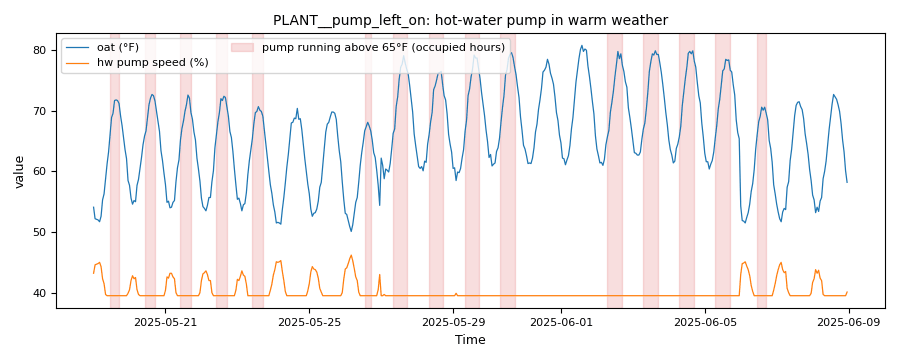

# Heating plant lockout: a boiler and a pump left on in warm weather

*Workbook exercise `plant-lockout` · PNNL re-tuning chapter 8 · about 30 minutes*

## Goal

Find a boiler left enabled through a warm spell and a hot-water pump left running with its
boiler locked out: two faults no open dataset in the catalog shows. Then find out how much the
verdict rests on the lockout temperature you choose, and read where each plant really stops
firing.

## Learn more

Read these first (PNNL, free):

- [Central Utility Plant Heating Control][pnnl-guide-plant-heating], the re-tuning guide: its
  advice to shut comfort-only boilers, and the pumps that serve them, down in warm weather is
  what this exercise checks.
- [Chapter 8: Central Utility Plant][pnnl-retuning-ch8] of the re-tuning training.

[pnnl-guide-plant-heating]: https://www.pnnl.gov/sites/default/files/media/file/pnnl_sa_89222.pdf "Building Re-Tuning Training Guide: Central Utility Plant Heating Control (PNNL-SA-89222)"
[pnnl-retuning-ch8]: https://www.pnnl.gov/sites/default/files/media/file/ch8_central_plant.pdf "Large Commercial Buildings: Re-tuning for Efficiency, chapter 8: Central Utility Plant: Pre-Re-Tuning and Re-Tuning (PNNL-SA-85063)"

## Datasets and licence

- **`synthetic-hw-plant-lockout`**: a **synthetic** hot-water plant that CAMBER generates on
  your computer. Nothing is downloaded and no real building is behind it. It holds hourly
  outdoor temperature, burner firing and gas input, hot-water pump status and speed, and the loop
  supply and return temperatures, for eight weeks of late spring with a warm spell. Licence
  **Apache-2.0** (CAMBER's own; the data may be shared). About 0.3 MB. See
  [synthetic datasets](../DATASETS.md#synthetic-datasets) for how CAMBER generates it.

The same weather drives four plants, each ingested as `PLANT__<plant>` in the facility
`ds-synthetic-hw-plant-lockout`: `PLANT__locked_out`, `PLANT__warm_spell`,
`PLANT__pump_left_on` and `PLANT__low_lockout`. Which is which is the exercise; the instructor
key describes how each was built.

## Setup

### In the lab

1. Run `camber lab` and open the URL it prints (`http://127.0.0.1:8765/lab?token=...`).
2. Tick `synthetic-hw-plant-lockout` (its kind reads `synthetic`) and press **Fetch & ingest**.
   CAMBER generates the file instead of downloading it, then ingests it like any other dataset.
3. When the job is done, the row links to **trends** (the trend viewer) and to **report**, the
   audit report of the dataset's template at the default 65 °F lockout. The threshold lesson in
   step 5 below uses the command line.

### On the command line

```
camber datasets fetch synthetic-hw-plant-lockout
camber datasets ingest synthetic-hw-plant-lockout --store lab_store
camber datasets config synthetic-hw-plant-lockout --exercise plant-lockout --store lab_store --out lock.json
camber run lock.json --out lock_out
camber datasets score synthetic-hw-plant-lockout --store lab_store --findings lock_out/findings.json
```

The exercise's config (`--exercise plant-lockout`) runs two rules at their defaults:
`boiler_summer_lockout` (the boiler's firing) and `hw_pump_summer_lockout` (the hot-water pump's
running), both against a 65 °F lockout. For the threshold lesson, two variants set the lockout on
`boiler_summer_lockout` only, and the pump rule takes the same value:

```
camber datasets config synthetic-hw-plant-lockout --exercise plant-lockout--58f --store lab_store --out lock58.json
camber run lock58.json --out lock58_out
camber datasets config synthetic-hw-plant-lockout --exercise plant-lockout--75f --store lab_store --out lock75.json
camber run lock75.json --out lock75_out
```

## Steps

1. **Look before you judge.** In the trend viewer, open each of the four plants and plot the
   outdoor temperature with the boiler firing and the pump status over the eight weeks. Find
   the warm spell.
2. **Run the exercise's config** (the commands above). For each plant, read
   `boiler_summer_lockout` and `hw_pump_summer_lockout` in `lock_out/findings.json`: the
   severity, `summer_run_pct`, `max_oat_running_f` and, for the pump, `boiler_off_pct`.
3. **The pump on its own.** Find the plant whose boiler passes while its pump fails. Read the
   pump finding's summary and `boiler_off_pct`.
4. **Score.** Run `camber datasets score` and read the rates for the two rules.
5. **Choose the lockout.** Run the `58f` and `75f` variants. For each plant, note which verdicts
   change and which stay. Read the pump findings' `lockout_oat_f` and `param_basis`.
6. **Where does it stop?** For each plant, read `max_oat_running_f` from the boiler finding and
   compare it with the lockout you used.

## Questions

1. At the default 65 °F lockout, which plants pass, which fail, and on which rule?
2. One plant passes `boiler_summer_lockout` but fails `hw_pump_summer_lockout`. What is wrong
   with it, and why can the boiler's check not see it? What does `boiler_off_pct` say about the
   warm-spell plant's pump?
3. What does the label score say for the two rules?
4. Lower the lockout to 58 °F. Which verdicts change? Which plant still passes, and what does that
   tell you about its own lockout? Where did the pump rule's lockout come from?
5. Raise the lockout to 75 °F. What happens to the warm-spell plant on each rule? Where does each
   plant actually stop firing, and how would you choose the lockout for a real site?

## What CAMBER shows

- **Findings.** `camber run` prints one line per finding: one per rule and plant.
- **Metrics.** Both rules report `summer_run_pct` (the share of occupied running hours with the
  outdoor temperature above `lockout_oat_f`), `n_running` and `max_oat_running_f` (the warmest
  outdoor temperature at which the boiler fired or the pump ran). The pump rule adds
  `pump_running_pct`, `run_source` and `boiler_off_pct` (of the pump's hours above the lockout,
  the share in which the boiler was not firing).
- **Severity.** Both rules warn at 5 % and fault at 20 % of running hours above the lockout.
- **Lockout.** `lockout_oat_f` is the value used. When the config sets it on
  `boiler_summer_lockout` only, the pump finding's `param_basis` says it was inherited from there.
- **Score.** `camber datasets score` prints the true- and false-positive rates for the entry's two
  declared detectors.



*From this exercise's synthetic plant `PLANT__pump_left_on`: the `hw_pump_summer_lockout` evidence trend, the outdoor temperature (°F) and the pump's speed (%) on one axis. The pump never stops; each shaded interval is an occupied hour it ran with the outdoor temperature above the 65 °F lockout.*

## Caveats

- The data are synthetic: CAMBER's own model of one plant, built to show these faults. They show
  what the rules see, not how real plants behave; never cite them as evidence about a building.
- Both rules judge occupied hours only (weekdays 07:00 to 18:00 by default), so a pump running
  every night is counted in its occupied hours only.
- The trend is hourly: a firing or a pump run shorter than an hour is invisible.
- A plant that serves dehumidification reheat or domestic hot water needs heat in warm weather;
  its lockout is higher, or the check does not apply.

## Going further

- Read [the boiler plant exercise](plant-boiler.md): its pump runs every hour of the year. Add
  `hw_pump_summer_lockout` to that exercise's config and see what the rule says about it.
- Build the RCx report of the default config
  (`camber report lock.json --out lock-rcx.html --layout rcx`) and read the "Verify on site"
  checklist of a failing plant: the 65 °F lockout is listed as a rule default to confirm against
  the site's own sequence.
