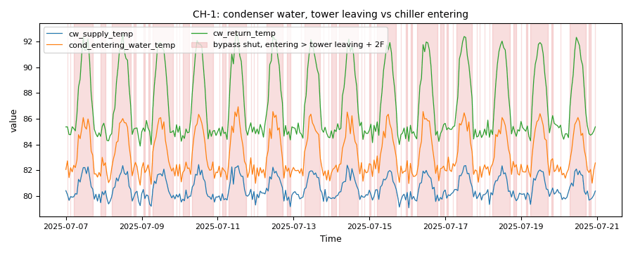

# Plant sensor faults vs equipment faults: why a sensor bias is a negative

*Workbook exercise `plant-sensor-vs-equipment` · PNNL re-tuning chapter 8 · about 45 minutes*

## Goal

A plant whose equipment is healthy but whose sensor lies can still set off a physical fault rule.
Run the plant rules over the dataset's sensor-bias runs, find where each lying sensor shows up,
tell a sensor problem from an equipment fault, and see why the label score counts an alarm on a
sensor-bias run as a false alarm rather than a detection.

## Learn more

Read these first (PNNL, free):

- [Central Utility Plant Cooling Control][pnnl-guide-plant-cooling], the re-tuning guide: every
  one of its trends rests on a few sensors (supply and return temperatures, loop DP). Read it
  asking what each conclusion would look like if one of those sensors were off by a few degrees.
- [Chapter 8: Central Utility Plant][pnnl-retuning-ch8] of the re-tuning training.

[pnnl-guide-plant-cooling]: https://www.pnnl.gov/sites/default/files/media/file/pnnl_sa_89198.pdf "Building Re-Tuning Training Guide: Central Utility Plant Cooling Control (PNNL-SA-89198)"
[pnnl-retuning-ch8]: https://www.pnnl.gov/sites/default/files/media/file/ch8_central_plant.pdf "Large Commercial Buildings: Re-tuning for Efficiency, chapter 8: Central Utility Plant: Pre-Re-Tuning and Re-Tuning (PNNL-SA-85063)"

## Datasets and licence

- **`lbnl-chiller`**: LBNL's simulated water-side chiller plant (three chillers, three cooling
  towers, primary and secondary chilled-water loops), a year at one-minute resolution, as a
  fault-free run plus labelled faulted runs. Licence **CC-BY-4.0** (open; cite it). The download
  is about 1.6 GB; this exercise ingests the `full` subset (all 24 runs). The catalog lists the
  problems found in the published data and how CAMBER handles each: see
  [its data issues](../DATASETS.md#lbnl-chiller-lbnl-simulated-chiller-plant-labelled-faults).

Each run becomes `PLANT__<run>` in the facility `ds-lbnl-chiller`. The sensor-bias runs are
labelled `sensor_bias`: chiller 1's leaving-water sensor (`PLANT__chiller_bias_1`,
`_2`, `_m1`, `_m2`: +1, +2, -1, -2 °C), tower 1's leaving-water sensor
(`PLANT__coolingtower_bias_1` ... `_m2`) and the secondary loop's DP sensor
(`PLANT__secondary_chilled_water_pressure_bias_010`, `_020`, `_m010`, `_m020`: +10, +20, -10,
-20 %). For comparison the exercise also reads real equipment faults: the stuck tower bypass
(`PLANT__bypass_stuck_075`) and the fouled chiller (`PLANT__chiller_fouling_065`).

## Setup

### In the lab

1. Run `camber lab` and open `http://127.0.0.1:8765/lab`.
2. Choose the **full** subset, tick `lbnl-chiller` and press **Fetch & ingest**.
3. When the job is done, the row links to **trends** (the trend viewer). This exercise uses its
   own config: use the command line for step 2 of the steps below.

### On the command line

```
camber datasets fetch lbnl-chiller
camber datasets ingest lbnl-chiller --subset full --store lab_store
camber datasets config lbnl-chiller --exercise plant-sensor-vs-equipment --store lab_store --out sensor.json
camber run sensor.json --out sensor_out
camber datasets score lbnl-chiller --store lab_store --findings sensor_out/findings.json
```

The exercise's config (`--exercise plant-sensor-vs-equipment`) runs four physical rules:
`chiller_efficiency` and `cooling_tower_approach` with the dataset template's calibrated ceilings
(so the score matches the template's), `condenser_bypass_leak`, and `chw_pump_dp_reset`.

## Steps

1. **Look before you judge.** In the trend viewer, compare `PLANT__fault_free` with
   `PLANT__chiller_bias_2`: plot chiller 1's leaving water and power over a summer week. The
   leaving water reads the same; what else changed?
2. **Run the exercise's config** (the commands above).
3. **The chiller sensor.** In `sensor_out/findings.json`, read `chiller_efficiency` and
   `chw_pump_dp_reset` for the four `chiller_bias` runs and the fault-free run.
4. **The tower sensor.** Read `condenser_bypass_leak` for the four `coolingtower_bias` runs and
   for `PLANT__bypass_stuck_075`: `severity`, `median_diff_f`, `attribution` and the caveats.
5. **The DP sensor.** Read `chw_pump_dp_reset` for the four secondary-loop DP biases. In the
   trend viewer, plot the loop DP against its setpoint for one of them.
6. **Score.** Run `camber datasets score` and find which runs count as false alarms.

## Questions

1. What does `chiller_efficiency` say about the chiller whose leaving-water sensor reads 2 °C
   high, and about the one reading 2 °C low? Is either chiller really worse or better?
2. Where else does the chiller sensor that reads low show up, and why?
3. How does CAMBER tell the tower-sensor biases apart from the leaking tower bypass, using only
   temperatures?
4. Where does a lying loop DP sensor show: in the DP reading or somewhere else? Why?
5. What false-positive rate does the score give `chiller_efficiency`, and why is an alarm on a
   sensor-bias run counted against the rule rather than for it?

## What CAMBER shows

- **Findings.** `findings.json` holds each rule's metrics and caveats. `condenser_bypass_leak`
  records an `attribution`: `valve` (a leak or a stuck valve) or `sensor_offset` (a difference
  between two sensors that does not grow with load), and a sensor offset is an `info`, not a
  fault.
- **Score.** `camber datasets score` scores the dataset's declared detectors
  (`chiller_efficiency`, `cooling_tower_approach`) and lists which rules fired on each labelled
  run. Its per-detector rates count every sensor-bias run as a negative.



*Synthetic illustration, not this exercise's dataset: the `condenser_bypass_leak` evidence trend. With the bypass valve shut, the water entering the chiller runs warmer than the water leaving the tower: either a leaking valve or a sensor offset, which the rule's `attribution` separates.*

## Caveats

- The data are simulated, and each bias is constant all year. A real sensor drifts slowly, so its
  signature changes over time rather than being there from day one.
- In this simulation the biased sensor is the one the controller holds at setpoint, so the biased
  reading itself looks normal and the effect appears elsewhere.
- `chiller_efficiency` computes tons from the leaving- and return-water temperatures. A bias on
  either one changes the computed load, not only the power.
- The score's false-positive rate is a property of the rule and this dataset together; a real
  plant's sensors fail in other ways.

## Going further

- Look at the ±1 °C runs as well. Which rules still react, and which do not?
- CAMBER's sensor-health and sensor-reference checks compare a sensor with an independent
  reference where one exists; the tower's leaving water and the chillers' entering water are such
  a pair here. See [the cooling-tower exercise](plant-cooling-tower.md) for the valve side of the
  same rule.
- Revisit [the chiller-efficiency exercise](plant-chiller-efficiency.md): which of its flagged runs
  would you send a technician to, and which to a calibration kit?
