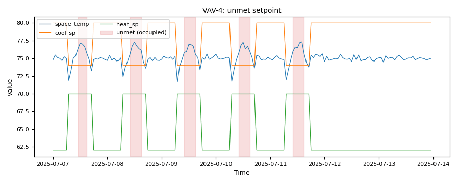

# Terminal units: one bad box in a fleet

*Workbook exercise `zone-bad-box` · PNNL re-tuning chapter 7 · about 45 minutes*

## Goal

Ten VAV boxes share one rooftop unit, and on six of seven test days one of them has its damper
stuck. Find that box from the trends and from the zone cohort, see how the rooftop unit reacts
to it, and find out how much a comfort rule alone can tell you. Then read the rule that judges
the damper itself against what its room asked for, and see why the healthy boxes, whose dampers
also sit still for hours, stay quiet. The published fault labels score both.

## Learn more

Read this first (PNNL, free):

- [Chapter 7: Terminal Units in Air Distribution System][pnnl-retuning-ch7] of the re-tuning
  training: what to trend on a terminal box, and what a box that does not respond to its
  controller looks like next to the ones that do.

[pnnl-retuning-ch7]: https://www.pnnl.gov/sites/default/files/media/file/ch7_terminal_units.pdf "Large Commercial Buildings: Re-tuning for Efficiency, chapter 7: Terminal Units in Air Distribution System: Pre-Re-Tuning and Re-Tuning (PNNL-SA-85063)"

## Datasets and licence

- **`ornl-frp-vav`**: a real two-storey test building at Oak Ridge National Laboratory: one
  rooftop unit and ten VAV boxes with electric reheat, logged every minute, one day per test
  scenario. Licence **CC-BY-4.0** (open; cite it). The default subset is one 7.7 MB workbook
  (test set 3). The catalog lists the problems found in the published data and how CAMBER
  handles each: see [its data issues](../DATASETS.md#ornl-frp-vav-ornl-multi-zone-vav-terminal-faults-real-building-labelled).

Each test day becomes eleven pieces of equipment in the facility `ds-ornl-frp-vav`: the rooftop
unit `RTU__d3_<day>` and its boxes `RTU_VAV_<room>__d3_<day>`, for rooms 102–106 and 202–206.
The days are `fault_free` and one box's damper stuck at 0, 20, 40, 60, 80 and 100 %
(`stuck_000` … `stuck_100`). The catalog's labels name the box under test; try to find it
before you look.

## Setup

### In the lab

1. Run `camber lab` and open `http://127.0.0.1:8765/lab`.
2. Tick `ornl-frp-vav` and press **Fetch & ingest** (it needs CAMBER's `xlsx` extra).
3. When the job is done, the row links to **trends** (the trend viewer) and **report** (the
   dataset's default config, the one this exercise uses).

### On the command line

```
camber datasets fetch ornl-frp-vav
camber datasets ingest ornl-frp-vav --store lab_store
camber datasets config ornl-frp-vav --store lab_store --out vav.json
camber run vav.json --out vav_out
camber datasets score ornl-frp-vav --store lab_store --findings vav_out/findings.json
```

The exercise uses the dataset's own config. Among its rules:

- `actuator_stuck` runs on every box. It is the dataset's declared detector: it finds the
  stretches where a damper holds one position, and judges each against the room's temperature
  and setpoints.
- `unmet_setpoint_hours` runs on every box, as context.
- `sat_rogue_zone_census` and `sat_cohort_starvation` read each day's ten boxes as one cohort
  under that day's rooftop unit. The grouping comes from the equipment names.

Its `_comment` lists the rules it leaves out, and why. Many are left out because no airflow
setpoint is logged.

## Steps

1. **Look at the cohort.** In the trend viewer, open the ten boxes of one faulted day (say
   `stuck_000`) and compare their damper positions over the occupied hours (07:00–22:00). Which
   box does not move? Do the same on another day.
2. **Compare the box with itself.** Put the suspect box's airflow on the fault-free day next to
   its airflow on the 0 % and 100 % days. Then compare it with the other nine boxes on those
   days.
3. **Run the config** (the commands above) and read the `unmet_setpoint_hours` finding for the
   suspect box on each day. Then read its `actuator_stuck` finding each day: the severity, the
   summary, and the `reason` and `tier` metrics.
4. **The cohort rules.** Find `sat_rogue_zone_census` and `sat_cohort_starvation` (equipment
   `<fleet>`). Which box drags which day's supply-air reset? Is any day's whole cohort starved?
5. **The rooftop unit.** Open `RTU__d3_stuck_000` … `RTU__d3_stuck_100` and compare their supply
   airflow and duct static pressure over the occupied hours.
6. **Score.** Run `camber datasets score` on the findings.

## Questions

1. Which box is under test, and what in the trends gives it away on every faulted day?
2. On the 0 % day and on the 100 % day, where does that box's airflow sit among its nine
   neighbours?
3. On which days does `unmet_setpoint_hours` flag the box under test, and on which does it stay
   quiet? Explain the quiet days.
4. The box under test is flagged on the fault-free day too. What does that tell you about its
   room?
5. What does the supply-air rogue-zone census say, and on which days? What does the
   cohort-starvation census add?
6. How does the rooftop unit react as the stuck damper goes from shut to fully open?
7. On which days does `actuator_stuck` flag the box under test, and why is it a fault on some
   days and only a warning on others? Its neighbours' dampers also hold one position for hours:
   why are they not flagged? What label score does it get, and what would
   `unmet_setpoint_hours` alone score (your answer to question 3)? Why is a comfort rule a poor
   stuck-damper detector here?
8. Room 102 is flagged on every day, whatever the test. Is that the fault under test?

## What CAMBER shows

- **Findings.** One `actuator_stuck` finding per box per day (`tier`, `reason`, `value`,
  `stuck_share`, and every flagged run under `roles`), one `unmet_setpoint_hours` finding per box
  per day (`unmet_pct`, `too_hot_pct`, `too_cold_pct`), and one `<fleet>` finding for each
  census. The rogue-zone census lists
  `rogue_by_group` (the rogue box of each day's rooftop unit) and `zone_request_share`.
- **Trends.** The trend viewer shows every box's damper, airflow, room temperature and
  setpoints, and the rooftop unit's airflow and static pressure.
- **Score.** `camber datasets score` prints the rates for the declared detector
  (`actuator_stuck` → stuck damper), scoring only the box under test on each day.



*Synthetic illustration, not this exercise's dataset: the `unmet_setpoint_hours` evidence trend for a box whose damper is stuck at 30 %. Shaded spans are the occupied hours the zone ran over its cooling setpoint.*

## Caveats

- Every scenario is a different day, with different weather. Comparing a box across days mixes
  the fault with the weather; comparing it with its neighbours on the same day does not.
- The ten rooms differ in size and load, so their airflows differ even when every box is
  healthy. Compare shapes (a flat damper) and ranks, not raw values.
- The reheat is electric and logged as energy, not as a valve, so no reheat rule can run here
  (see [`zone-reheat-saturated`](zone-reheat-saturated.md)).
- The rooftop unit's reaction is read from its own trends, one day per position, so it carries
  the weather differences too.
- No airflow setpoint is logged, so `airflow_tracking` (the rule that finds stuck dampers on
  `lbnl-fpu`) cannot run.

## Going further

- The `full` subset (`camber datasets ingest ornl-frp-vav --subset full --store lab_store`) adds
  test sets 1 and 2 (the box of rooms 106 and 104 under test) and two airflow-sensor-bias sets.
  Does `actuator_stuck` find the box under test in each set? Look closely at set 1's 100 % day.
- Copy `vav.json` and add `cohort_airflow` to its rules with
  `"params": {"group_by_topology": true}`, so each day's ten boxes are compared only with each
  other. Does the raw mean airflow pick out the stuck box? Try `"normalise": "design_max"` with a
  `"design_max"` map of each box's largest airflow, then a cohort on the damper itself (in Python:
  `CohortDeviation(Role.DAMPER, group_by_topology=True, summary="variability", tail="low")`).
  Which comparison isolates the stuck box, and why does evening out the box sizes not?
