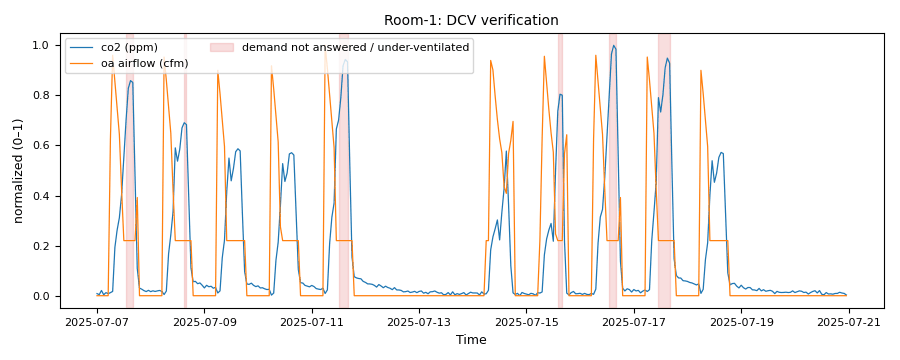

# Ventilation: is outdoor air following occupancy (DCV)?

*Workbook exercise `zone-dcv` · PNNL re-tuning chapter 5 · about 60 minutes*

## Goal

Demand-controlled ventilation (DCV) should bring in more outdoor air when a space fills up and
less when it empties. Check that claim on three open datasets: a room running a documented DCV
law, rooms whose ventilation valve follows both a clock and CO₂, and teaching rooms with a VAV
damper. Along the way, learn two things that matter more than any single verdict. First,
"not judged" is an honest answer and not a failure. Second, the verdict can depend on which CO₂
sensor you trust.

## Learn more

Read these first (PNNL, free):

- [AHU Minimum Outdoor-Air Operation][pnnl-guide-min-oa], the re-tuning guide on outdoor air:
  what it asks about minimum outdoor-air settings and about DCV.
- [Chapter 5: Air Handling Units][pnnl-retuning-ch5] of the re-tuning training, for outdoor air
  in the context of the whole air-handler sequence.

[pnnl-guide-min-oa]: https://www.pnnl.gov/sites/default/files/media/file/pnnl_sa_88958.pdf "Building Re-Tuning Training Guide: AHU Minimum Outdoor-Air Operation (PNNL-SA-88958)"
[pnnl-retuning-ch5]: https://www.pnnl.gov/sites/default/files/media/file/ch5_air_handling.pdf "Large Commercial Buildings: Re-tuning for Efficiency, chapter 5: Air Handling Units: Pre-Re-Tuning and Trending and Re-Tuning (PNNL-SA-85063)"

CAMBER's own [ventilation page](../VENTILATION.md#dcv-verification) explains how the DCV check
chooses the samples it judges and how it reaches a verdict.

## Datasets and licence

- **`finnish-dcv`**: one laboratory office room ventilated with outdoor air, with ground-truth
  occupant counts: two training records under assorted ventilation strategies, and a 24-hour
  test that ran an occupancy-based DCV law. Licence **CC-BY-4.0** (open; cite it). 1.4 MB. See
  [its data issues](../DATASETS.md#finnish-dcv-finnish-laboratory-office-room-with-occupancy-based-dcv-ground-truth-counts).
- **`b4b-windesheim`**: three office rooms in the Netherlands over three to four weeks, each with
  a building-system CO₂ sensor, a ventilation valve and presence; two rooms also have a second,
  desk-mounted CO₂ sensor. Licence **CC-BY-4.0** (open; cite it). 1.2 MB. See
  [its data issues](../DATASETS.md#b4b-windesheim-brains4buildings-windesheim-office-rooms-two-co2-sensors-ventilation-valve-and-occupancy).
- **`sdu-ou44`**: three university teaching rooms in Denmark (a lecture room and two study
  zones) with CO₂, the room's VAV damper and camera occupant counts, on 44 anonymised workdays.
  Licence **CC0-1.0** (public domain). 8.6 MB. See
  [its data issues](../DATASETS.md#sdu-ou44-sdu-ou44-room-co2-vav-damper-and-camera-occupant-counts-denmark-3-rooms).

The equipment:

- `finnish-dcv`: `ROOM__training_1`, `ROOM__training_2` and `ROOM__ventilation_test`, one per
  file.
- `b4b-windesheim`: `ROOM_917810`, `ROOM_999169` and `ROOM_925038`, plus `ROOM_917810_scd41`
  and `ROOM_999169_scd41`. The last two are the same rooms judged on their desk sensors.
- `sdu-ou44`: `ROOM1` (the lecture room), `ROOM2` and `ROOM3`.

## Setup

### In the lab

1. Run `camber lab` and open the URL it prints (`http://127.0.0.1:8765/lab?token=...`).
2. Tick `finnish-dcv`, `b4b-windesheim` and `sdu-ou44` and press **Fetch & ingest**.
3. When the jobs are done, each row links to **trends** and to **report**. The report runs the
   dataset's default config, which is the config this exercise uses, so you can do the whole
   exercise in the lab.

### On the command line

```
camber datasets fetch finnish-dcv
camber datasets ingest finnish-dcv --store lab_store
camber datasets config finnish-dcv --store lab_store --out finnish.json
camber run finnish.json --out finnish_out
camber datasets fetch b4b-windesheim
camber datasets ingest b4b-windesheim --store lab_store
camber datasets config b4b-windesheim --store lab_store --out b4b.json
camber run b4b.json --out b4b_out
camber datasets fetch sdu-ou44
camber datasets ingest sdu-ou44 --store lab_store
camber datasets config sdu-ou44 --store lab_store --out ou44.json
camber run ou44.json --out ou44_out
```

Each dataset's own config runs `dcv_verification`, and `co2_ventilation` too for `b4b-windesheim`
and `sdu-ou44`. Read each config's `_comment`: it says which outdoor-air signal stands in for
outdoor air in each dataset (a measured supply flow, a valve opening, a damper position) and why
some rules are left out.

## Steps

1. **Look first.** In the trend viewer, open `ROOM__ventilation_test` and plot the supply
   airflow, the room CO₂ and the occupant count on one axis each. Does the airflow step with the
   count?
2. **Run the three configs** and read each `dcv_verification` finding: its verdict (the
   summary), `demand_lift` (CO₂ when outdoor air was raised, minus CO₂ when it sat at its floor,
   compared within each hour of the day), `lift_basis` and, where given,
   `excess_at_low_demand_pct`.
3. **The Finnish room.** Compare the ventilation test with the two training records.
4. **Two sensors, one room.** In `b4b-windesheim`, compare each room's verdict on its
   building-system sensor with the verdict on its desk sensor. Look at room 999169's two CO₂
   traces together in the trend viewer.
5. **The rooms that are not judged.** In `sdu-ou44`, read the verdicts for `ROOM2` and `ROOM3`,
   and their `reason`. Then look at the `co2_ventilation` findings.

## Questions

1. Does outdoor air follow demand in the Finnish ventilation test? How large is the CO₂ lift
   CAMBER measures?
2. That room's finding is a **warn**, not `ok`. What does it flag, and which documented number
   in the dataset explains it?
3. What does CAMBER say about the two Finnish training records, and why is that the right
   answer rather than a fault?
4. In `b4b-windesheim`, which room reads "functioning" on both of its CO₂ sensors, and which one
   depends on the sensor? Give the two lifts for that room.
5. Why does room 925038 get no DCV verdict at all?
6. Every `b4b-windesheim` room reads **over-ventilated** in `co2_ventilation`. Is that a
   contradiction with "DCV functioning"?
7. In `sdu-ou44`, which room is judged "functioning", and with what lift? Why are the other two
   "not judged", and is that bad news?
8. How would you decide which CO₂ sensor to trust before re-tuning a DCV sequence?

## What CAMBER shows

- **Findings.** `dcv_verification` gives one finding per room with its verdict (`status`:
  functioning, static, uncorrelated or insufficient), `reason`, `demand_lift`,
  `demand_lift_pooled`, `correlation` (a diagnostic only), `modulation` and the floor checks.
  `co2_ventilation` gives the CO₂ median and the share of occupied hours near outdoor CO₂
  (`over_vent_pct`).
- **Severity.** `ok` is functioning. `info` means not judged, or OA moving but not with demand
  when the economizer could not be ruled out. `warn` covers a static damper, and outdoor air
  held above the floor at low demand. `fault` covers a CO₂ breach at minimum or occupied hours
  unventilated.
- **Report.** Each row's **report** link in the lab shows the same findings with evidence
  charts.



*Synthetic illustration, not this exercise's dataset: the room CO₂ and outdoor-air trends that `dcv_verification` draws as its evidence, each scaled 0–1, from CAMBER's DCV simulator with the outdoor air held at a fixed position. The shaded samples are the ones behind the verdict: judged samples at high demand, with the outdoor air still at its fixed position. The outdoor-air peaks are economizer hours, which the rule leaves out.*

## Caveats

- The Finnish test controlled the airflow on a machine-learning occupant *estimate*; CAMBER maps
  the ground-truth count, and the two disagree about a quarter of the time.
- The Finnish and Danish files are sets of separate days, not continuous records; the Danish
  days are anonymised and shuffled onto a synthetic calendar, so no schedule, drift or M&V
  analysis applies.
- The Windesheim CO₂ values were baseline-shifted by the publisher (each sensor's minimum reads
  416 ppm); the valve opening is a position, not a measured flow.
- The Danish times are UTC; the config shifts the occupied window to match.
- A "functioning" verdict says outdoor air rises with CO₂; it does not say the rates are right.
  That is the [`zone-min-oa`](zone-min-oa.md) exercise.

## Going further

- Re-run the Finnish ventilation test with `"occupied_only": true` in the `dcv_verification`
  params and explain the change (the config's `_comment` predicts it).
- Set `"stratify_hour": false` on the `b4b-windesheim` config's `dcv_verification` and compare
  the pooled verdicts with the within-hour ones: what does a clock-driven valve do to a pooled
  comparison?
- [`VENTILATION.md`](../VENTILATION.md#validation-and-limits) lists the validation data behind
  the DCV check, including a lecture theatre whose fan was off while CO₂ sat at its sensor's
  full scale.
